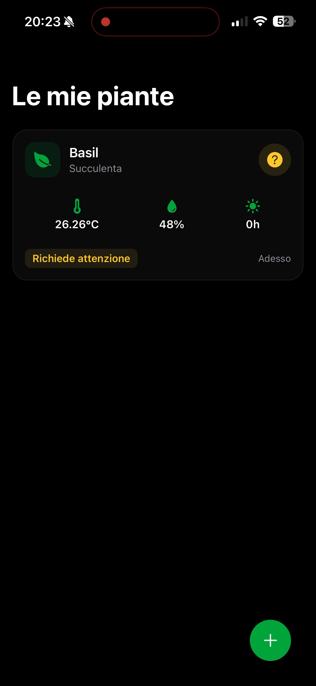
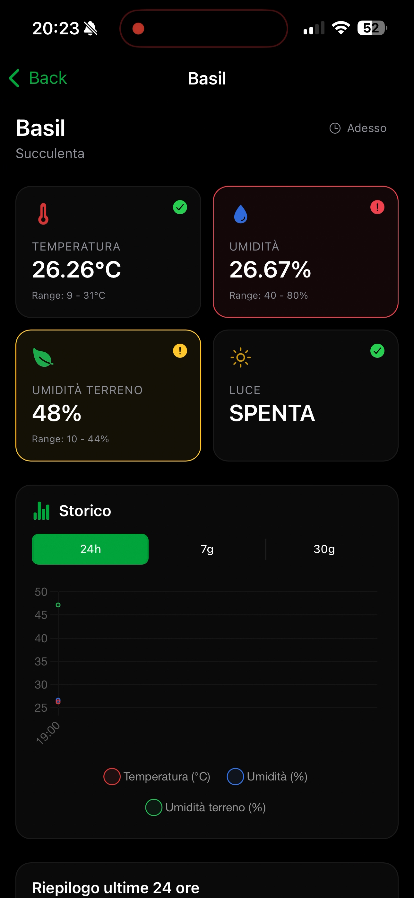
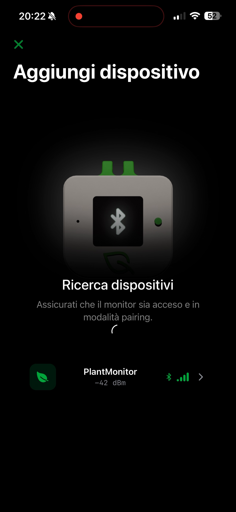
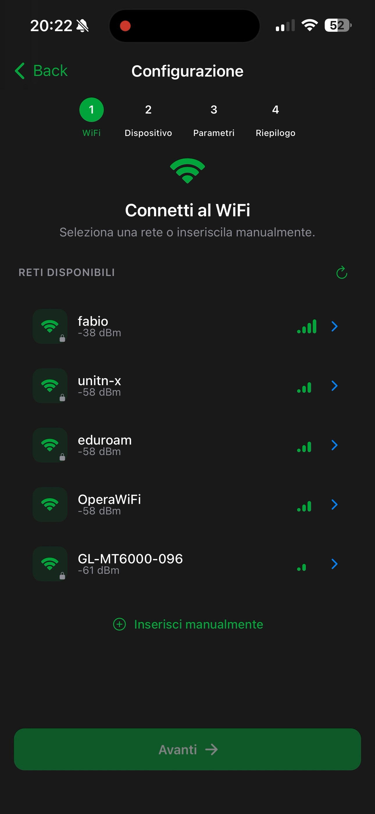
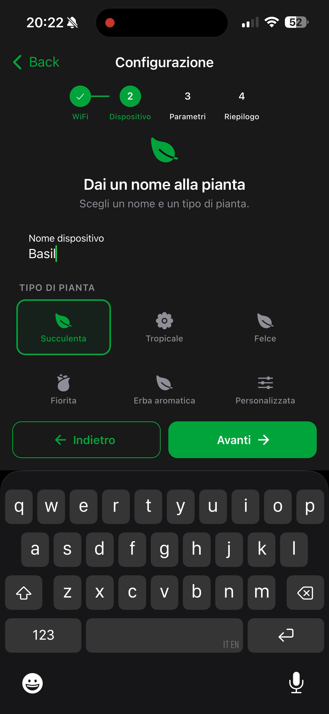
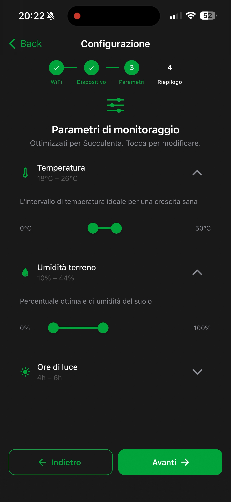
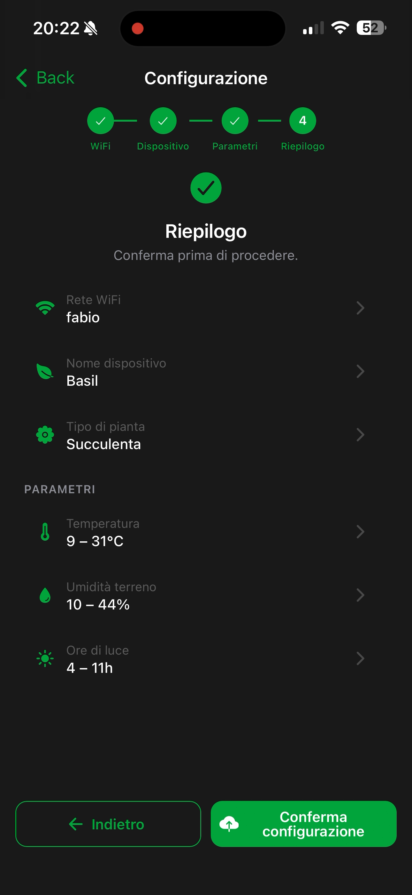

# IoT Plant Monitor App

Cross-platform mobile app for plant monitoring through ESP32-based IoT devices. The app allows you to configure sensors via Bluetooth, view environmental data in real time, and receive notifications when plant conditions are not optimal.

## System Architecture

The project consists of three components:

| Component | Repository | Description |
|-----------|------------|-------------|
| **Mobile App** | this repository | User interface for configuration and monitoring |
| **IoT Device** | [iot-plant-monitor](https://github.com/valedotc/iot-plant-monitor) | ESP32 firmware with BME280, moisture, and photoresistor sensors |
| **Backend** | [backend-plant-monitor](https://github.com/valedotc/backend-plant-monitor) | REST API and push notification system |

```
┌──────────────┐     BLE      ┌──────────────┐     MQTT/TLS     ┌──────────────┐
│  Mobile App  │◄────────────►│    ESP32      │────────────────►│   Backend    │
│  (Ionic/Angular)            │  + Sensors    │                 │  (Node.js)   │
└──────┬───────┘              └──────────────┘                  └──────┬───────┘
       │                                                               │
       │                    REST API + FCM Push                        │
       └───────────────────────────────────────────────────────────────┘
```

## Key Features

- **BLE Configuration** — Guided ESP32 device setup via Bluetooth Low Energy (Nordic UART Service)
- **WiFi Scanning** — Select and test WiFi networks directly from the app
- **Dashboard** — Real-time overview of all plants with status indicators (happy/ok/sad)
- **Historical Charts** — Temperature, humidity, and soil moisture trends with 24h, 7-day, and 30-day filters
- **Push Notifications** — Real-time alerts via Firebase Cloud Messaging when parameters go out of range
- **Daily Reminder** — Configurable local notification to remind you to check your plants
- **Plant Presets** — 6 preconfigured profiles (succulent, tropical, fern, flowering, herb, custom)
- **Multilanguage** — English and Italian support with automatic device language detection

## Screenshots

### Dashboard

Real-time overview of all your plants with status indicators, sensor readings, and online/offline detection.

<p align="center">
  
  
</p>

### Device Setup

4-step guided wizard: scan for BLE devices, connect to WiFi, name your plant, configure monitoring thresholds, and review before confirming.

<p align="center">
  
  
  
</p>
<p align="center">
  
  
</p>

## Tech Stack

- **Framework** — Angular 20 + Ionic 8
- **Native Runtime** — Capacitor 8
- **Language** — TypeScript 5.9
- **Charts** — Chart.js + ng2-charts
- **i18n** — @ngx-translate
- **BLE** — @capacitor-community/bluetooth-le
- **Notifications** — @capacitor/push-notifications + @capacitor/local-notifications

## Prerequisites

- Node.js ≥ 18
- npm or yarn
- Ionic CLI (`npm install -g @ionic/cli`)
- For native builds: Xcode (iOS) / Android Studio (Android)

## Installation

```bash
# Clone the repository
git clone https://github.com/valedotc/app-plant-monitor.git
cd app-plant-monitor

# Install dependencies
npm install

# Start in development mode (browser)
ionic serve

# Build for Android
ionic cap build android

# Build for iOS
ionic cap build ios
```

## Project Structure

```
src/
├── app/
│   ├── home/                    # Dashboard with plant cards
│   ├── add-device/              # BLE scan and device selection
│   │   └── selected/            # Configuration wizard (4 steps)
│   ├── plant-detail/            # Plant detail with charts
│   ├── components/
│   │   ├── plant-status-card/   # Plant status card
│   │   └── device-card/         # Device selection card
│   ├── services/
│   │   ├── bluetooth.service    # BLE communication with ESP32
│   │   ├── plant-data.service   # Backend data polling
│   │   ├── configuration.service # Local configuration storage
│   │   ├── notification.service # Local and push notifications
│   │   └── language.service     # Language management
│   └── models/                  # TypeScript interfaces and types
├── shared/models/               # Shared models (BLE, thresholds)
└── assets/i18n/                 # Translation files (en.json, it.json)
```

## BLE Protocol

The app communicates with the ESP32 via the Nordic UART Service (NUS):

| Characteristic | UUID | Direction |
|----------------|------|-----------|
| Service | `6e400001-b5a3-f393-e0a9-e50e24dcca9e` | — |
| RX | `6e400002-b5a3-f393-e0a9-e50e24dcca9e` | App → ESP32 |
| TX | `6e400003-b5a3-f393-e0a9-e50e24dcca9e` | ESP32 → App |

Commands are sent as JSON and include: `ping`, `get_info`, `config`, `test_wifi`, `wifi_scan`, `reset`.

## License

MIT
